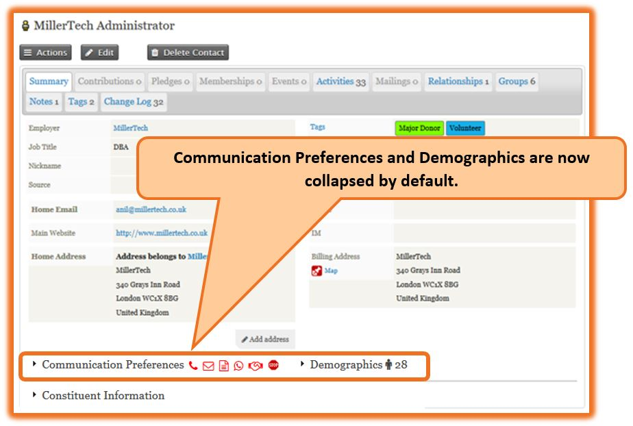
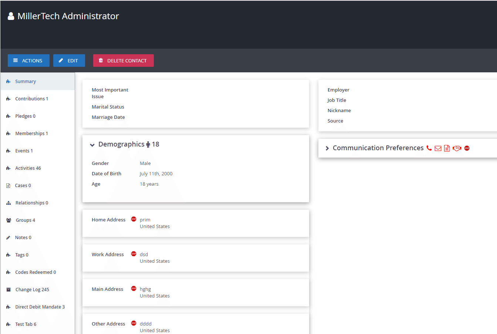

# uk.co.millertech.collapsecommsanddemographics





**Compatible with [Shoreditch Theme (org.civicrm.shoreditch)](https://github.com/civicrm/org.civicrm.shoreditch) and [Contact Summary Layout Editor (org.civicrm.contactlayout)](https://github.com/civicrm/org.civicrm.contactlayout)**

Collapse communication preferences and demographics sections on contact summary screen. In addition, displays warning icons, age and gender on the collapsed titles. 

Please refer User guide for further details.

The extension is licensed under [AGPL-3.0](LICENSE.txt).

## Requirements

* PHP v5.4+
* CiviCRM 4.7
* CiviCRM 5.0
* CiviCRM 5.3

## Installation (Web UI)

This extension has not yet been published for installation via the web UI.

## Installation (CLI, Zip)

Sysadmins and developers may download the `.zip` file for this extension and
install it with the command-line tool [cv](https://github.com/civicrm/cv).

```bash
cd <extension-dir>
cv dl uk.co.millertech.collapsecommsanddemographics@https://github.com/chamilwijesooriya/uk.co.millertech.collapsecommsanddemographics/archive/master.zip
```

## Installation (CLI, Git)

Sysadmins and developers may clone the [Git](https://en.wikipedia.org/wiki/Git) repo for this extension and
install it with the command-line tool [cv](https://github.com/civicrm/cv).

```bash
git clone https://github.com/chamilwijesooriya/uk.co.millertech.collapsecommsanddemographics.git
cv en collapsecommsanddemographics
```

## Usage

No special configurations needed.
